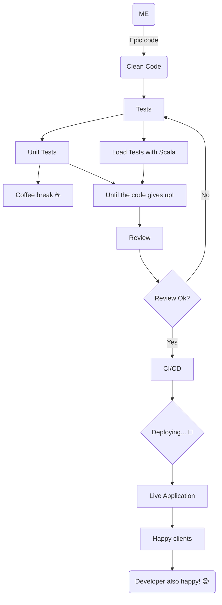

## ```{ name: "Diego Horvatti", age: "22", locale: "pt-BR/en"}```

- *Just a developer passionate about creating clean and efficient code.*
- *Design patterns and SOLID with TDD are my afternoon coffee*
- *I believe that TypeScript helps more than it gets in the way.*
- *Always looking for teams that want to make a difference with technical excellence.*
- *When I'm not coding, I'm probably listening to music or at the gym.*

### Currently contributing to the Mongoose and ClickHouse Community

<p align=center>
  <a href="https://www.linkedin.com/in/diego-horvatti">
    
  </a>
</p>

### How I see an ideal development process scenario:



Contact: d.horvattid@gmail.com
