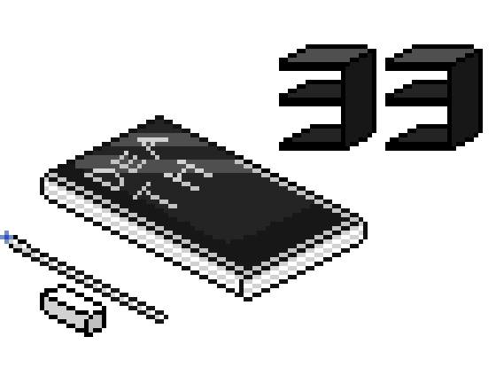
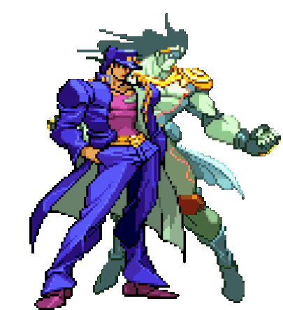
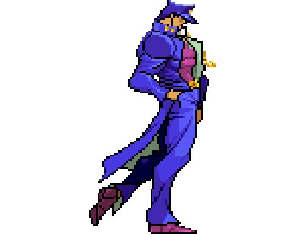
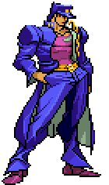
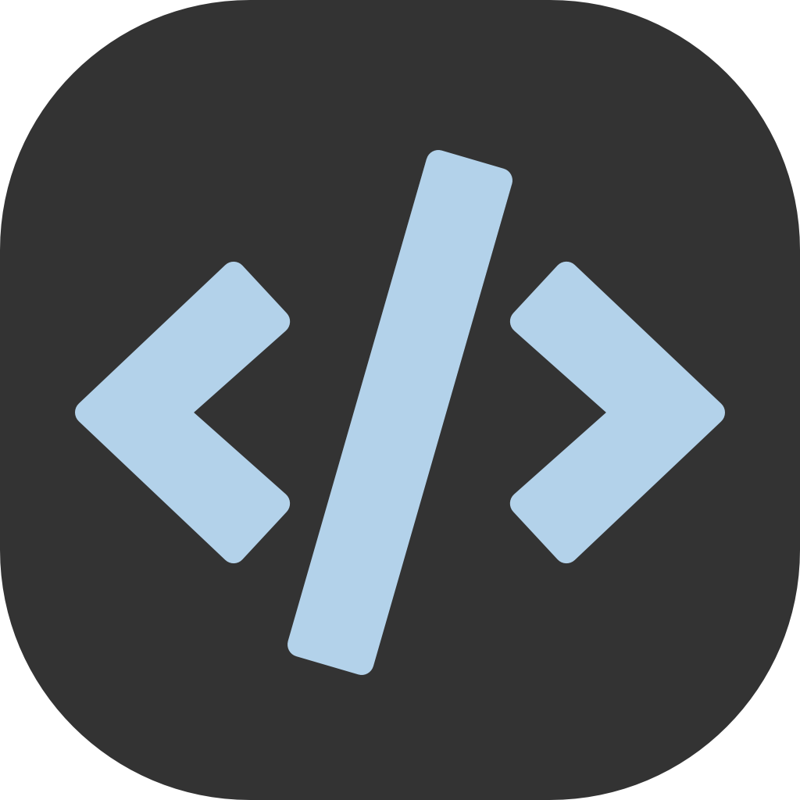
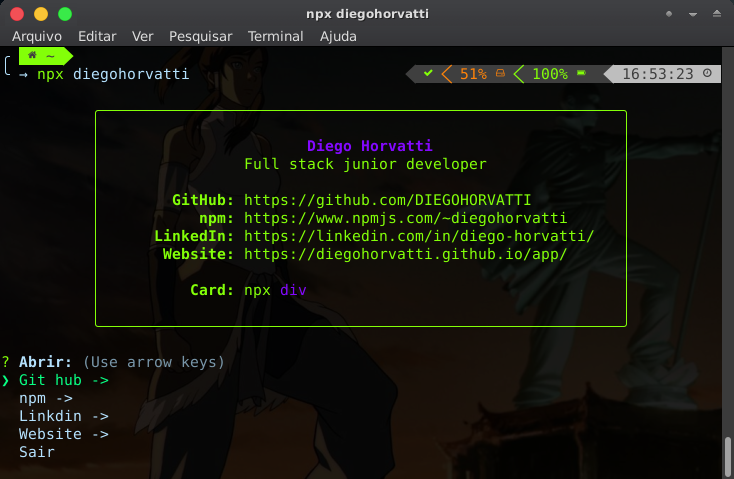

<a href="https://discord.gg/VfVB9CP3"></a>

<table width="100%" border="0">
  <tr>
    <td>
      
    </td>
    <td>
      
    </td>
  </tr>
</table>


<table width="100%" border="0">
  <tr>
    <td width="50%">
      
    </td>
    <td>
      
    </td>
  </tr>
</table>

<table width="100%" border="0">
  <tr>
    <td width="50%" align="center" >
      <p><h4><strike>Escreva algo bom no meu livro de visitas</strike> ↴</h4></p>
    <a href="https://github.com/DIEGOHORVATTI/DIEGOHORVATTI/issues" target="blank">
      
     </a>
    </td>
    <td>
      
    </td>
  </tr>
</table>
<br />

<h4><b><i>Técnologias que tenho experiência</i></b></h4>
<div>
  <span>
    
  </span>
  <span>
    
  </span>
  <span>
    
  </span>
  <span>
    
  </span>
  <span>
    
  </span>
  <span>
    
  </span>
  <span>
    
  </span>
  <span>
    
  </span>
  <span>
    
  </span>
  <span>
    
  </span>
  <span>
    
  </span>
  <span>
    
  </span>
  <span>
    
  </span>
  <span>
    
  </span>
  <span>
    
  </span>
  <span>
    
  </span>
  <span>
    
  </span>
  <span>
    
  </span>
  <span>
    
  </span>
</div>
<br />

<h2 align="center">&nbsp;<i>Sobre mim ヘ( ^o^)ノ＼(^_^ )</i></h2>

<table border="0">
  <tr>
    <td>
        
        Atualmente estou estudando c, c++, python+arduino, python e c++ com qt5, sql, java e .lua
      </p>
    </td>
  </tr>
</table>

<div>
  
  <div align="left">
    <p><b>➥ Nome:</b> Diego Horvatti</p>
    <p><b>➥ Idade:</b> 19 y</p>
    <p><b>➥ Apelido:</b> Div</p>
    <p><b>➥ Hobbies:</b> Ler Mangás e Novels como se não houvesse um amanhã</p>
  </div>
</div>

<br /><br />
<div align="center">
  <h3>&nbsp;<i>Me contate</i> </h3>
  <div>
     <span>
      <a href="https://api.whatsapp.com/send?phone=5567984541223&text=Olla!" target="blank">
        
      </a>
    </span>
    <span>
      <a href="mailto:d.horvattid@gmail.com" target="blank"></a>
    </span>
    <span>
      <a href="https://www.linkedin.com/in/diego-horvatti/" target="blank"></a>
    </span>
    <span>
      <a href="https://discord.gg/rRP7RYnRxf" target="blank"></a>
    </span>
  </div>
</div>
<br /><br /><br />

<!--START_SECTION:waka-->


**Eu sou noturno 🦉** 

```text
🌞 Manhã      77 commits     ███░░░░░░░░░░░░░░░░░░░░░░   14.64% 
🌆 Tarde      145 commits    ███████░░░░░░░░░░░░░░░░░░   27.57% 
🌃 Noite      181 commits    ████████░░░░░░░░░░░░░░░░░   34.41% 
🌙 Madrugada  123 commits    █████░░░░░░░░░░░░░░░░░░░░   23.38%

```
📅 **Sou mais produtivo em sábado** 

```text
Segunda-Feira52 commits     ██░░░░░░░░░░░░░░░░░░░░░░░   9.89% 
Terça-Feira  54 commits     ██░░░░░░░░░░░░░░░░░░░░░░░   10.27% 
Quarta-Feira 87 commits     ████░░░░░░░░░░░░░░░░░░░░░   16.54% 
Quinta-Feira 86 commits     ████░░░░░░░░░░░░░░░░░░░░░   16.35% 
Sexta-Feira  54 commits     ██░░░░░░░░░░░░░░░░░░░░░░░   10.27% 
sábado       100 commits    ████░░░░░░░░░░░░░░░░░░░░░   19.01% 
domingo      93 commits     ████░░░░░░░░░░░░░░░░░░░░░   17.68%

```


📊 **Esta semana eu gastei meu tempo em** 

```text
⌚︎ Fuso horário: America/Campo_Grande

💬 Linguagens de programação: 
sh                       14 hrs 1 min        ████████████░░░░░░░░░░░░░   50.26% 
C++                      5 hrs 9 mins        ████░░░░░░░░░░░░░░░░░░░░░   18.5% 
Bash                     3 hrs 50 mins       ███░░░░░░░░░░░░░░░░░░░░░░   13.76% 
CSS                      2 hrs 41 mins       ██░░░░░░░░░░░░░░░░░░░░░░░   9.63% 
JSON                     49 mins             ░░░░░░░░░░░░░░░░░░░░░░░░░   2.96%

🔥 Editores: 
Zsh                      14 hrs 1 min        ████████████░░░░░░░░░░░░░   50.26% 
VS Code                  13 hrs 52 mins      ████████████░░░░░░░░░░░░░   49.74%

🐱‍💻 Projetos: 
c_oo                     9 hrs 22 mins       ████████░░░░░░░░░░░░░░░░░   33.59% 
Terminal                 8 hrs 39 mins       ███████░░░░░░░░░░░░░░░░░░   31.06% 
Dev                      4 hrs 44 mins       ████░░░░░░░░░░░░░░░░░░░░░   16.99% 
sigaa-san                3 hrs 58 mins       ███░░░░░░░░░░░░░░░░░░░░░░   14.26% 
AnimeBackgrounds         23 mins             ░░░░░░░░░░░░░░░░░░░░░░░░░   1.41%

💻 Sistema operacional: 
Linux                    27 hrs 53 mins      █████████████████████████   100.0%

```

**Eu geralmente programo em JavaScript** 

```text
JavaScript               6 repos             █████░░░░░░░░░░░░░░░░░░░░   20.0% 
HTML                     5 repos             ████░░░░░░░░░░░░░░░░░░░░░   16.67% 
Shell                    5 repos             ████░░░░░░░░░░░░░░░░░░░░░   16.67% 
C++                      3 repos             ██░░░░░░░░░░░░░░░░░░░░░░░   10.0% 
C                        3 repos             ██░░░░░░░░░░░░░░░░░░░░░░░   10.0%

```


 Last Updated on 26/08/2022 02:26:27 UTC
<!--END_SECTION:waka-->
  
  
<div align="center" width="100%">
  <a href="#">
    
    
  </a>
</div>
  
<div align="center">
  <tr>
    <td>
      <h4>Veja sobre mim no seu terminal!</h4>
    </td>
    <td>
      <pre>npx diegohorvatti</pre>
    </td>
  </tr>
  <br>
  <a href="https://www.npmjs.com/package/diegohorvatti">
    
  </a>
<div>
<br/>
<hr>

<table width="100%" border="0">
<tr>
  <h3>Dowload CV (curriculo)</h3>
  <td>
    <a href="https://github.com/DIEGOHORVATTI/IFC" >
    
  </a>
  </td>
  <td>
    <a href="./public/docs/CV.pdf" >
      <br />
      
  </a>
  </td>
</tr>
</table>
<br />

<div align="right">
 <a href="https://github.com/DIEGOHORVATTI">
  
  </a>
  <a href="https://wakatime.com/@Div"></a>

  <!-- 
  <a href="https://badges.pufler.dev">
    
  </a> 
  -->
</div>