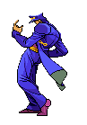

<hr />
<div align="center">
  <span>All Languages>>&nbsp;&nbsp;</span>
  <span>
    <a href="README_en.md">
       English ★★★
    </a>
  </span>
  <span>&nbsp;&nbsp;/&nbsp;&nbsp;&nbsp;</span>
  <span>
    <a href="README_hi.md">
       Hindi ★★★
    </a>
  </span>
  <span>&nbsp;&nbsp;/&nbsp;&nbsp;&nbsp;</span>
  <span>
    <a href="README_es.md">
       Espanhol ★★☆
    </a>
    </span>
  <span>&nbsp;&nbsp;/&nbsp;&nbsp;&nbsp;</span>
  <span>
   <a href="README_ch.md">
      Chinese ★★☆
    </a>
    </span>
</div>
<hr />

<a href="https://discord.gg/VfVB9CP3"></a>

<table width="100%" border="0">
  <tr>
    <td>
      
    </td>
    <td>
      
    </td>
  </tr>
</table>

<table width="100%" border="0">
  <tr>
    <td width="50%">
      
    </td>
    <td>
      
    </td>
  </tr>
</table>

<table width="100%" border="0">
  <tr>
    <td width="50%" align="center" >
      <p><h4><strike>Escreva algo bom no meu livro de visitas</strike> ↴</h4></p>
    <a href="https://github.com/DIEGOHORVATTI/DIEGOHORVATTI/issues" target="blank">
      
     </a>
    </td>
    <td>
      
    </td>
  </tr>
</table>

<br />

<h4><b><i>Técnologias que tenho experiência</i></b></h4>
<div>
    <span>
    
  </span>
  <span>
    
  </span>
  <span>
    
  </span>
  <span>
    
  </span>
  <span>
    
  </span>
  <span>
    
  </span>
  <span>
    
  </span>
  <span>
    
  </span>
  <span>
    
  </span>
  <span>
    
  </span>
  <span>
    
  </span>
  <span>
    
  </span>
  <span>
    
  </span>
  <span>
    
  </span>
  <span>
    
  </span>
  <span>
    
  </span>
  <span>
    
  </span>
</div>
<br />

<h2 align="center">&nbsp;<i>Sobre mim</i></h2>

<table border="0">
  <tr>
    <td>
      <p> Olá, eu sou um desenvolvedor full-stack, estudo Ciências da Computação e + alguns cursos de web design e bootcamps (Rocketseat).<br />
&nbsp;Pretendo me especializar em Neurociência Computacional.</p>
    </td>
    <td>
      <p>
        
        Atualmente estou me aprofundando até a fossas das marianas em ReactJS, NextJS e Sass/scss.
      </p>
    </td>
  </tr>
</table>

<div>
  
  <div align="left">
    <p><b>➥ Name:</b> Diego Horvatti</p>
    <p><b>➥ Idade:</b> 19y/o</p>
    <p><b>➥ Apelido:</b> Div</p>
    <p><b>➥ Hobbies:</b> Ler Mangás e Novels como se não houvesse um amanhã</p>
  </div>
</div>

<br /><br />
<div align="center">
  <h3>&nbsp;<i>Me contate</i> </h3>
  <div>
     <span>
      <a href="https://api.whatsapp.com/send?phone=5567984541223&text=Olla!" target="blank">
        
      </a>
    </span>
    <span>
      <a href="mailto:d.horvattid@gmail.com" target="blank"></a>
    </span>
    <span>
      <a href="https://www.linkedin.com/in/diego-horvatti/" target="blank"></a>
    </span>
    <span>
      <a href="https://discord.gg/rRP7RYnRxf" target="blank"></a>
    </span>
  </div>
</div>
<br /><br /><br />

<!--START_SECTION:waka-->


**Eu sou diurno 🐤** 

```text
🌞 Manhã      30 commits     ███░░░░░░░░░░░░░░░░░░░░░░   12.24% 
🌆 Tarde      110 commits    ███████████░░░░░░░░░░░░░░   44.9% 
🌃 Noite      87 commits     █████████░░░░░░░░░░░░░░░░   35.51% 
🌙 Madrugada  18 commits     █░░░░░░░░░░░░░░░░░░░░░░░░   7.35%

```
📅 **Sou mais produtivo em Quarta-Feira** 

```text
Segunda-Feira11 commits     █░░░░░░░░░░░░░░░░░░░░░░░░   4.49% 
Terça-Feira  26 commits     ██░░░░░░░░░░░░░░░░░░░░░░░   10.61% 
Quarta-Feira 60 commits     ██████░░░░░░░░░░░░░░░░░░░   24.49% 
Quinta-Feira 24 commits     ██░░░░░░░░░░░░░░░░░░░░░░░   9.8% 
Sexta-Feira  33 commits     ███░░░░░░░░░░░░░░░░░░░░░░   13.47% 
sábado       42 commits     ████░░░░░░░░░░░░░░░░░░░░░   17.14% 
domingo      49 commits     █████░░░░░░░░░░░░░░░░░░░░   20.0%

```


📊 **Esta semana eu gastei meu tempo em** 

```text
⌚︎ Fuso horário: America/Campo_Grande

💬 Linguagens de programação: 
C++                      3 hrs 25 mins       ███████░░░░░░░░░░░░░░░░░░   27.74% 
JavaScript               3 hrs 22 mins       ██████░░░░░░░░░░░░░░░░░░░   27.38% 
Other                    3 hrs 7 mins        ██████░░░░░░░░░░░░░░░░░░░   25.35% 
HTML                     1 hr 30 mins        ███░░░░░░░░░░░░░░░░░░░░░░   12.19% 
CSS                      33 mins             █░░░░░░░░░░░░░░░░░░░░░░░░   4.58%

🔥 Editores: 
VS Code                  12 hrs 21 mins      █████████████████████████   100.0%

🐱‍💻 Projetos: 
nodejs                   5 hrs 21 mins       ██████████░░░░░░░░░░░░░░░   43.43% 
piloto                   3 hrs 25 mins       ███████░░░░░░░░░░░░░░░░░░   27.74% 
Unknown Project          1 hr 44 mins        ███░░░░░░░░░░░░░░░░░░░░░░   14.13% 
victorconky              1 hr 40 mins        ███░░░░░░░░░░░░░░░░░░░░░░   13.61% 
macos                    4 mins              ░░░░░░░░░░░░░░░░░░░░░░░░░   0.57%

💻 Sistema operacional: 
Linux                    12 hrs 21 mins      █████████████████████████   100.0%

```

**Eu geralmente programo em HTML** 

```text
HTML                     6 repos             ████████░░░░░░░░░░░░░░░░░   31.58% 
Shell                    4 repos             █████░░░░░░░░░░░░░░░░░░░░   21.05% 
JavaScript               4 repos             █████░░░░░░░░░░░░░░░░░░░░   21.05% 
C++                      2 repos             ██░░░░░░░░░░░░░░░░░░░░░░░   10.53% 
CSS                      1 repo              █░░░░░░░░░░░░░░░░░░░░░░░░   5.26%

```


 Last Updated on 07/03/2022 01:17:27 UTC
<!--END_SECTION:waka-->
  
  
<div align="center" width="100%">
  <a href="#">
    
    
  </a>
</div>
  
<div align="center">
  <tr>
    <td>
      <h4>Veja sobre mim no seu terminal!</h4>
    </td>
    <td>
      <pre>npx diegohorvatti</pre>
    </td>
  </tr>
  <br>
  <a href="https://www.npmjs.com/package/diegohorvatti">
    
  </a>
<div>

<br/>
<hr>
  <div align="center">
    <h3>Dowload CV (curriculo)</h3>
    <a href="./public/docs/CV.pdf" >
       
    </a>
  </div>
  
<br />

<div align="right">
 <a href="https://github.com/DIEGOHORVATTI">
  
  </a>
  <a href="https://wakatime.com/@Div"></a>
  <a href="https://badges.pufler.dev">
    
  </a>
</div>

<hr /><br />
<h3 align="center">Inspirational references:</h3>

<table border="1" align="center">
    <tr>
        <td>Inspired portfolio:</td>
        <td>Generates a snake:</td>
        <td>Waka metrics stats :</td>
    </tr>
    <tr>
        <td>
           <a href="https://github.com/arifszn/ezprofile">
          
          <h3>Ariful Alam </h3>
          </a>
        </td>
        <td>
          <a href="https://github.com/Platane/snk">
          
          <h3>Platane</h3>
          </a>
        </td>
        <td>
          <a href="https://github.com/anmol098/waka-readme-stats">
          
          <h3>Anmol Singh</h3>
          </a>
        </td>
    </tr>
</table>