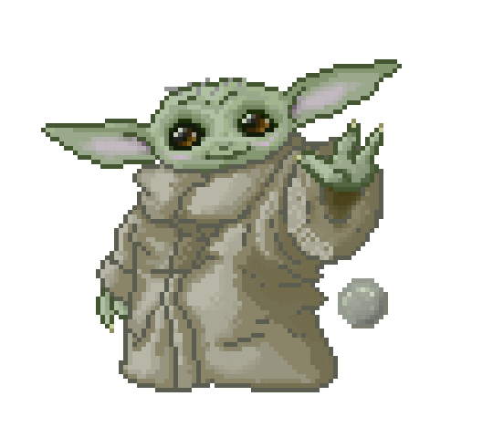

<a href="https://discord.gg/VfVB9CP3"></a>

<table width="100%" border="0">
  <tr>
    <td>
      
    </td>
    <td>
      
    </td>
  </tr>
</table>


<table width="100%" border="0">
  <tr>
    <td width="50%">
      
    </td>
    <td>
      
    </td>
  </tr>
</table>

<table width="100%" border="0">
  <tr>
    <td width="50%" align="center" >
      <p><h4><strike>Escreva algo bom no meu livro de visitas</strike> ↴</h4></p>
    <a href="https://github.com/DIEGOHORVATTI/DIEGOHORVATTI/issues" target="blank">
      
     </a>
    </td>
    <td>
      
    </td>
  </tr>
</table>
<br />

<h4><b><i>Técnologias que tenho experiência</i></b></h4>
<div>
  <span>
    
  </span>
  <span>
    
  </span>
  <span>
    
  </span>
  <span>
    
  </span>
  <span>
    
  </span>
  <span>
    
  </span>
  <span>
    
  </span>
  <span>
    
  </span>
  <span>
    
  </span>
  <span>
    
  </span>
  <span>
    
  </span>
  <span>
    
  </span>
  <span>
    
  </span>
  <span>
    
  </span>
  <span>
    
  </span>
  <span>
    
  </span>
  <span>
    
  </span>
  <span>
    
  </span>
  <span>
    
  </span>
</div>
<br />

<h2 align="center">&nbsp;<i>Sobre mim ヘ( ^o^)ノ＼(^_^ )</i></h2>

<table border="0">
  <tr>
    <td>
        
        Atualmente cursando ciência da computação e estudando Reactjs com styledComponent, Nextjs e Arduino também estágio na @Leadeasy <a href="https://github.com/div-leadeasy">div-leadeasy</a>
      </p>
    </td>
  </tr>
</table>

<div>
  
  <div align="left">
  <p>
  <b>typedef</b> <i>struct</i>{<br/>
  &nbsp;&nbsp;&nbsp;<b>char</b> Nome = "Diego Horvatti"<br/>
  &nbsp;&nbsp;&nbsp;<b>int</b> Idade = 20<br/>
  &nbsp;&nbsp;&nbsp;<b>char</b> Apelido = "Div"<br/>
  &nbsp;&nbsp;&nbsp;<b>char</b> Hobbies = "Mangás, Novels, Basquete"<br/>
  }sEstudant;<br/>
  </p>
  </div>
</div>

<br /><br />
<div align="center">
  <h3>&nbsp;<i>Me contate</i> </h3>
  <div>
     <span>
      <a href="https://api.whatsapp.com/send?phone=5567984541223&text=Olla!" target="blank">
        
      </a>
    </span>
    <span>
      <a href="mailto:d.horvattid@gmail.com" target="blank"></a>
    </span>
    <span>
      <a href="https://www.linkedin.com/in/diego-horvatti/" target="blank"></a>
    </span>
    <span>
      <a href="https://discord.gg/rRP7RYnRxf" target="blank"></a>
    </span>
  </div>
</div>
<br /><br /><br />

<!--START_SECTION:waka-->


**Eu sou noturno 🦉** 

```text
🌞 Manhã      65 commits     ███░░░░░░░░░░░░░░░░░░░░░░   12.15% 
🌆 Tarde      142 commits    ██████░░░░░░░░░░░░░░░░░░░   26.54% 
🌃 Noite      190 commits    █████████░░░░░░░░░░░░░░░░   35.51% 
🌙 Madrugada  138 commits    ██████░░░░░░░░░░░░░░░░░░░   25.79%

```
📅 **Sou mais produtivo em Sábado** 

```text
Segunda-Feira66 commits     ███░░░░░░░░░░░░░░░░░░░░░░   12.34% 
Terça-Feira  54 commits     ██░░░░░░░░░░░░░░░░░░░░░░░   10.09% 
Quarta-Feira 79 commits     ███░░░░░░░░░░░░░░░░░░░░░░   14.77% 
Quinta-Feira 93 commits     ████░░░░░░░░░░░░░░░░░░░░░   17.38% 
Sexta-Feira  56 commits     ██░░░░░░░░░░░░░░░░░░░░░░░   10.47% 
Sábado       107 commits    █████░░░░░░░░░░░░░░░░░░░░   20.0% 
Domingo      80 commits     ███░░░░░░░░░░░░░░░░░░░░░░   14.95%

```


📊 **Esta semana eu gastei meu tempo em** 

```text
⌚︎ Fuso horário: America/Campo_Grande

💬 Linguagens de programação: 
TypeScript               21 hrs 9 mins       ███████████░░░░░░░░░░░░░░   45.69% 
Other                    16 hrs 11 mins      ████████░░░░░░░░░░░░░░░░░   34.95% 
sh                       7 hrs 44 mins       ████░░░░░░░░░░░░░░░░░░░░░   16.71% 
INI                      20 mins             ░░░░░░░░░░░░░░░░░░░░░░░░░   0.74% 
JavaScript               18 mins             ░░░░░░░░░░░░░░░░░░░░░░░░░   0.67%

🔥 Editores: 
VS Code                  21 hrs 45 mins      ███████████░░░░░░░░░░░░░░   46.96% 
Browser                  16 hrs 10 mins      ████████░░░░░░░░░░░░░░░░░   34.92% 
Zsh                      7 hrs 44 mins       ████░░░░░░░░░░░░░░░░░░░░░   16.71% 
Sublime Text             39 mins             ░░░░░░░░░░░░░░░░░░░░░░░░░   1.41%

🐱‍💻 Projetos: 
leadeasy-webclient       35 hrs 16 mins      ███████████████████░░░░░░   76.17% 
CSS                      5 hrs 14 mins       ██░░░░░░░░░░░░░░░░░░░░░░░   11.31% 
Terminal                 3 hrs 9 mins        █░░░░░░░░░░░░░░░░░░░░░░░░   6.84% 
biometria_arduino_website1 hr 32 mins        ░░░░░░░░░░░░░░░░░░░░░░░░░   3.34% 
esp-idf                  27 mins             ░░░░░░░░░░░░░░░░░░░░░░░░░   0.97%

💻 Sistema operacional: 
Linux                    46 hrs 19 mins      █████████████████████████   100.0%

```

**Eu geralmente programo em JavaScript** 

```text
JavaScript               7 repos             ████░░░░░░░░░░░░░░░░░░░░░   18.42% 
Shell                    6 repos             ████░░░░░░░░░░░░░░░░░░░░░   15.79% 
C++                      6 repos             ████░░░░░░░░░░░░░░░░░░░░░   15.79% 
HTML                     5 repos             ███░░░░░░░░░░░░░░░░░░░░░░   13.16% 
CSS                      3 repos             ██░░░░░░░░░░░░░░░░░░░░░░░   7.89%

```


 Last Updated on 25/12/2022 01:28:29 UTC
<!--END_SECTION:waka-->
  
  
<div align="center" width="100%">
  <a href="#">
    
    
  </a>
</div>
  
<div align="center">
  <tr>
    <td>
      <h4>Veja sobre mim no seu terminal!</h4>
    </td>
    <td>
      <pre>npx diegohorvatti</pre>
    </td>
  </tr>
  <br>
  <a href="https://www.npmjs.com/package/diegohorvatti">
    
  </a>
<div>
<br/>
<hr>

<table width="100%" border="0">
<tr>
  <h3>Dowload CV (curriculo)</h3>
  <td>
    <a href="https://github.com/DIEGOHORVATTI/IFC" >
    
  </a>
  </td>
  <td>
    <a href="./public/docs/CV.pdf" >
      <br />
      
  </a>
  </td>
</tr>
</table>
<br />
<hr/>


<div align="right">
  <a href="https://github.com/DIEGOHORVATTI">
    
  </a>
  <a href="https://wakatime.com/@Div"></a>

  
</div>
