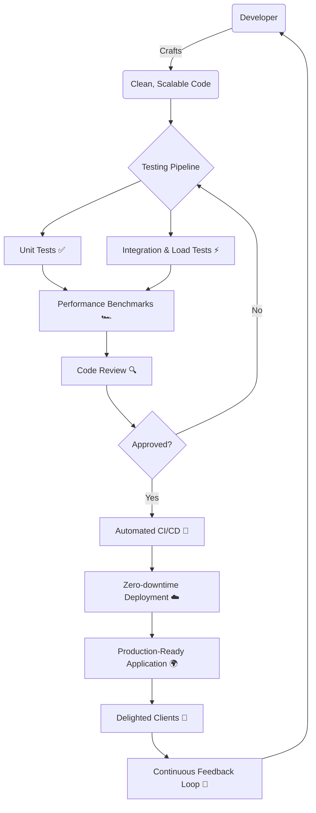

# Hi, I'm Diego Horvatti 👋

**Full Stack Engineer** — TypeScript, scalable architectures, and automation.

I work end-to-end on SaaS platforms and data-heavy products: API design, data modeling,
integrations, automated testing, CI/CD, and production deployment. Real-world experience
restructuring core products, omnichannel systems, massive forms, microservices, and
large-scale data pipelines. Technical, direct, and results-oriented.

🌐 [horvatti.com](https://horvatti.com) · 📍 Florianópolis, SC — Brazil

---

### Stack

`TypeScript` `JavaScript` `Python` `SQL`
`React` `Next.js` `Vite` `Lit` `Material UI` `Redux Toolkit`
`Node.js` `Bun` `Express` `REST` `GraphQL` `oRPC` `tRPC` `Zod` `WebSockets`
`PostgreSQL` `MongoDB` `Redis` `ClickHouse` `SQLite` `Drizzle ORM`
`Vitest` `Jest` `Cypress` `Docker` `Docker Swarm` `GitLab CI/CD` `Vercel`

---

### A few numbers

- **8% → 93.5%** test coverage on an omnichannel contact center platform
- **~90%** faster builds after migrating a legacy setup to Vite
- **~90%** less load on PostgreSQL by moving analytics to ClickHouse
- **10k+** users on a field-operations SaaS I helped modernize

---

### How I see an ideal development process

```mermaid
flowchart TD
  A(Developer) -->|Crafts| B(Clean, Scalable Code)
  B --> C{Testing Pipeline}
  C --> D[Unit Tests ✅]
  C --> E[Integration & Load Tests ⚡]
  D --> F[Performance Benchmarks 🏎️]
  E --> F
  F --> G[Code Review 🔍]
  G --> H{Approved?}
  H -- Yes --> I[Automated CI/CD 🚀]
  H -- No --> C
  I --> J[Zero-downtime Deployment ☁️]
  J --> K[Production-Ready Application 🌍]
  K --> L[Delighted Clients 🙌]
  L --> M[Continuous Feedback Loop 🔄]
  M --> A
```

---

### Contact

📧 **d.horvattid@gmail.com**
📱 **WhatsApp:** [+55 49 99195-4455](https://api.whatsapp.com/send/?phone=5549991954455)
💼 **LinkedIn:** [diego-horvatti](https://www.linkedin.com/in/diego-horvatti)
