## ```{ name: "Diego Horvatti", age: "22", locale: "pt-BR/en"}```

- *Just a developer passionate about creating clean and efficient code.*
- *Design patterns and SOLID with TDD are my afternoon coffee*
- *I believe that TypeScript helps more than it gets in the way.*
- *Always looking for teams that want to make a difference with technical excellence.*
- *When I'm not coding, I'm probably listening to music or at the gym.*

### How I see an ideal development process scenario:

```mermaid
flowchart TD
    A(ME) -->|Epic code| B(Clean Code)
    B --> C{Tests}
    C --> D[Unit Tests]
    D --> O[Coffee break ☕]
    C --> E[Load Tests with Scala]
    D --> N[Performance challenges⚡]
    E --> N[Until the code gives up!]
    N --> P[Review]
    P --> Q{Review Ok?}
    Q -- Yes --> G[CI/CD]
    Q -- No --> C[Tests]
    G --> H{Deploying... 🚀}
    H --> I[Live Application]
    I --> J[Happy clients]
    J --> K(Developer also happy! 😊)
```




Contact: d.horvattid@gmail.com
