### Software Engineer with a strong focus on TypeScript, scalable architectures, and automation. Hands-on experience with highly complex systems, omnichannel, CI/CD pipelines, and AWS cloud. Real-world experience in restructuring core products, massive forms, microservices, and large-scale data integration. Technical, direct, and results-oriented profile.

---

### Contact

📧 **d.horvattid@gmail.com**  
📱 **WhatsApp:** [+55 49 99195-4455](https://api.whatsapp.com/send/?phone=5549991954455)  
💼 **LinkedIn:** [diego-horvatti](https://www.linkedin.com/in/diego-horvatti)

---

### How I see an ideal development process

```mermaid
flowchart TD
  A(Developer) -->|Crafts| B(Clean, Scalable Code)
  B --> C{Testing Pipeline}
  C --> D[Unit Tests ✅]
  C --> E[Integration & Load Tests ⚡]
  D --> F[Performance Benchmarks 🏎️]
  E --> F
  F --> G[Code Review 🔍]
  G --> H{Approved?}
  H -- Yes --> I[Automated CI/CD 🚀]
  H -- No --> C
  I --> J[Zero-downtime Deployment ☁️]
  J --> K[Production-Ready Application 🌍]
  K --> L[Delighted Clients 🙌]
  L --> M[Continuous Feedback Loop 🔄]
  M --> A
```

